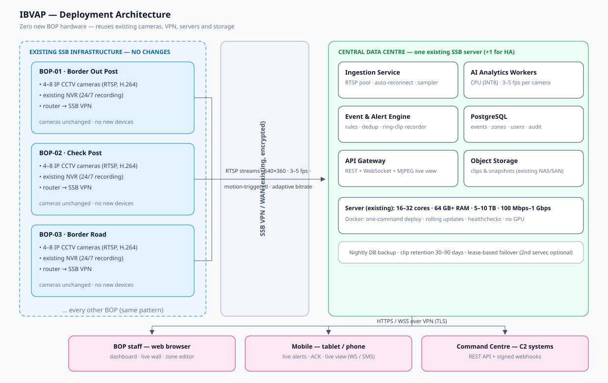
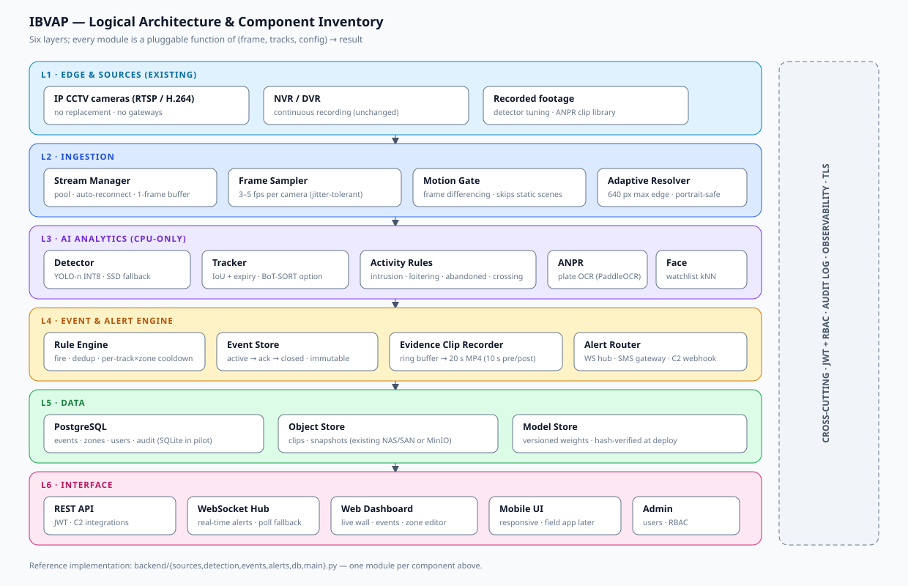
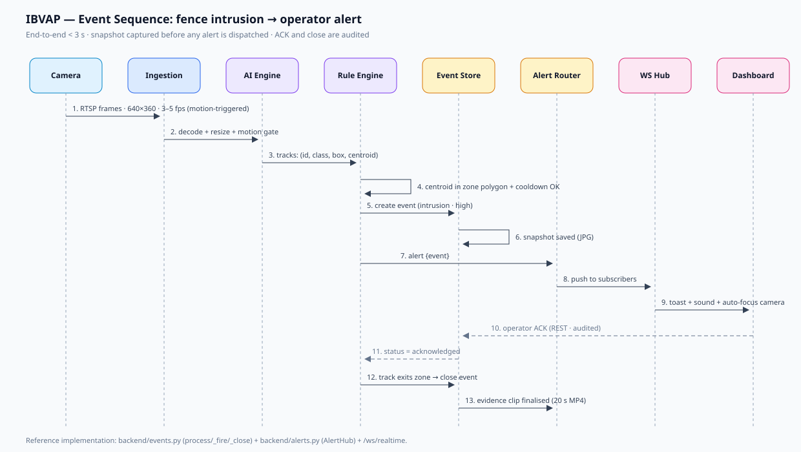
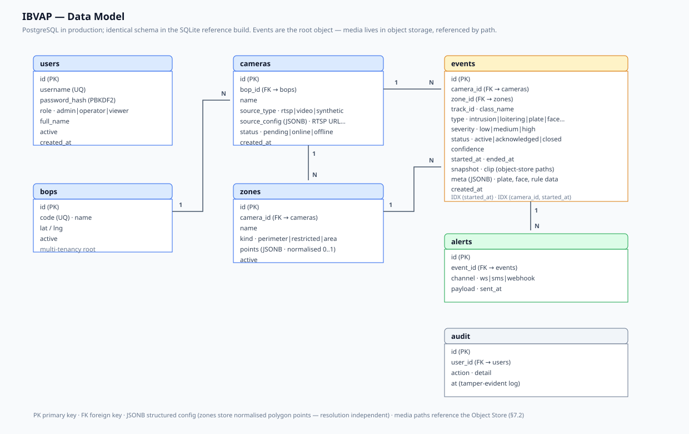

# IBVAP — System Architecture

**AI-Based Intelligent Video Analytics Platform for Border Surveillance**
Proposal ref: Problem Statement 26187 (MoHA / SSB) · Document v1.0

This document is the complete, buildable system architecture for IBVAP. Every
component maps 1:1 to the reference implementation in this repository
(`backend/`, `frontend/`), and each production element states the exact
technology, interface, and sizing rationale so the design can be built or
extended without re-architecting.

> Companion diagrams (this folder: `../diagrams/`):
> 1. `deployment-architecture.svg` — physical deployment on existing SSB infrastructure
> 2. `logical-architecture.svg` — software layers & component inventory
> 3. `frame-pipeline.svg` — per-frame data flow with cost/latency budgets
> 4. `event-sequence.svg` — intrusion → alert sequence
> 5. `db-er.svg` — entity-relationship model

---

## 1. Overview & Goals

IBVAP turns SSB's **existing** CCTV estate into an intelligent surveillance
network with **zero new hardware at BOPs**:

| Goal | Architecture decision |
|---|---|
| Works with existing IP cameras | RTSP ingestion over the existing SSB VPN (no gateways, no camera swaps) |
| No per-camera analytics hardware | Centralised software workers on existing data-centre servers |
| CPU-only (no GPUs) | Nano-class models, INT8, 3–5 FPS/camera sampling, motion-gated processing |
| Near-zero storage | Event-only storage: snapshots + 20 s evidence clips (99% reduction) |
| Bandwidth that fits existing WAN | Analytics streams at 640×360 @ 3–5 fps (~0.5–0.8 Mbps/cam, pulled on demand) |
| Flat, one-time cost | 100% open-source stack, no licences, containerised one-command deploy |
| < 3 s alert latency | Single-hop pipeline: frame → detect → rule → WS push, no message broker on hot path |
| Scales 10 → 1000+ cameras | Worker-per-camera threads → process pool → second node + LB (sub-linear cost) |

Non-goals (deliberate): continuous AI recording (existing NVRs keep doing
that), edge inference at BOPs, proprietary VMS compatibility.

---

## 2. Design Principles

1. **Reuse before you buy.** Every SSB asset (cameras, VPN, servers, NAS,
   IT staff) is a first-class input. New purchases are optional fallbacks.
2. **Software-defined intelligence.** Analytics is a service, not a device.
   New rules/models deploy to the central server; BOPs change nothing.
3. **Event-centric, not stream-centric.** The system is designed around
   *events* (intrusion, loitering, plate) — recording, storage, alerts and
   UI all key off the event object.
4. **Graceful degradation.** Camera down → worker isolates fault and
   reconnects with backoff; one camera's loss never impacts others.
   WS down → dashboard falls back to HTTP polling (implemented).
5. **Fail cheap.** The whole platform is one Docker image + a SQLite file
   (pilot) — worst-case recovery is a re-deploy from backup.
6. **Security by default.** TLS everywhere, JWT + RBAC, tamper-evident audit
   log, media signed and retained on policy.

---

## 3. Deployment Architecture



### 3.1 Topology (single node — pilot and ≤ ~200 cameras)

```
BOP-01 ─┐  4–8 IP cameras, existing NVR
BOP-02 ─┤  ┌───────────────────────────────┐
BOP-03 ─┼──│  SSB VPN / WAN (existing)      │
 ...    ─┘  └──────────────┬──────────────┘
                           ▼
        ┌──────────────────────────────────────────────┐
        │  CENTRAL SERVER (existing SSB data centre)    │
        │  Docker host running the IBVAP stack:         │
        │   • nginx (TLS termination, MFA proxy)        │
        │   • api+app container (FastAPI, workers)      │
        │   • postgres container (or SSB PG cluster)    │
        │   • NAS/SAN mount for clips & snapshots       │
        └──────────────────────────────────────────────┘
                           ▲ HTTPS/WSS
        ┌──────────────┬───┴───────────┬────────────────┐
   BOP staff browser  mobile browser  command centre
   (dashboard)        (alerts, live)  (C2 via REST API)
```

* One Ubuntu Server 22.04/24.04 machine (existing), 16–32 cores, 64 GB+ RAM,
  5–10 TB storage (NAS/SAN acceptable), 100 Mbps–1 Gbps.
* No changes to any BOP: cameras stay on their existing NVR; IBVAP opens
  parallel RTSP sessions to the cameras through the VPN (read-only, no load
  on the NVR).
* All operator access is via the web (desktop, tablet, phone) — nothing to
  install, nothing to patch at the border.

### 3.2 Scaled topology (> 200 cameras / HA required)

* **Node A (primary) + Node B (hot standby or active-active).** The app is
  stateless per camera: a camera's worker can run on either node. Camera
  assignments live in PostgreSQL (a `cameras.worker_node` column); on node
  failure a supervisor re-claims its cameras (lease-based, 30 s TTL).
* **Load balancer** (nginx HAProxy) terminates TLS in front of both nodes;
  WebSocket `sticky` sessions per dashboard user.
* **Shared object storage** (NAS/SAN, NFS) for clips/snapshots; **PostgreSQL
  streaming replication** for the DB; nightly `pg_dump` + clip retention
  pruning (30–90 days policy).
* Bandwidth per node stays ~100–160 Mbps at 200 cameras (see §12 capacity).

---

## 4. Logical Architecture & Component Inventory



Layers (top = network edge, bottom = presentation):

### L1 — Edge & sources
| Component | Responsibility | Tech |
|---|---|---|
| IP CCTV (existing) | H.264/H.265 RTSP, sub-stream preferred | Vendor-agnostic |
| NVR (existing, optional) | 24/7 continuous recording (unchanged) | — |
| Recorded footage | Detector tuning / ANPR clip library | MP4 files |

### L2 — Ingestion (`backend/sources.py`)
| Component | Responsibility | Tech |
|---|---|---|
| `RTSPSource` | Open/pool RTSP session, auto-reconnect w/ exponential backoff, 1-frame buffer (drop stale) | OpenCV/FFmpeg (C-FFmpeg backend) |
| `VideoFileSource` | Looping local file (evidence/tuning) | OpenCV |
| `SyntheticSource` | Procedural demo scenes w/ ground truth (MVP) | numpy/OpenCV |
| Frame sampler | Throttle to target 3–5 FPS per camera (jitter-tolerant) | time-based loop |
| Motion gate | Frame differencing (grayscale, threshold) — skip analytics when static | OpenCV |
| Adaptive resolver | Resize so max dimension = 640 px (handles portrait feeds) | OpenCV |

### L3 — AI Analytics (`backend/detection.py`)
| Component | Responsibility | Tech |
|---|---|---|
| Detector (pluggable) | Person/vehicle/2-wheel detection, conf-gated | **YOLOv8n / YOLO11n** (ultralytics, CPU, INT8 via OpenVINO in prod); **MobileNet-SSD** (cv2.dnn) fallback; sim mode for tests |
| Tracker | Greedy IoU association + 1.6 s expiry → stable track IDs (BoT-SORT optional upgrade) | in-process |
| Activity rules | Per-track: zone intrusion, loitering, (abandoned-object, crossing) | point-in-polygon + timers |
| ANPR module (prod) | Plate crop → OCR → watchlist match; runs on person/vehicle tracks with a vehicle in frame | PaddleOCR (CPU) behind same seam |
| Face module (prod) | Face detection + embedding + watchlist kNN | InsightFace (CPU, INT8) — same seam |

**Key property:** every module is a stateless function of
`(frame, tracks, config) → result`; adding a detector or a rule never
touches ingestion, storage or UI.

### L4 — Event & Alert engine (`backend/events.py`, `alerts.py`)
| Component | Responsibility |
|---|---|
| Rule engine | Fires events on track/zone transitions (dedup + cooldown per track×zone) |
| Event store (DB) | Event lifecycle: `active → acknowledged → closed`; writes snapshot path, clip path |
| Evidence clip recorder | Per-camera ring buffer (20 s @ 2 fps); on close, finalises 10 s pre + post MP4 |
| Alert router | Fans out to channels: **WebSocket hub** (dashboards), **SMS gateway** (operator mobiles), **C2 webhook** (command systems) |

### L5 — Data (`backend/db.py`)
PostgreSQL (SQLite in reference build — identical schema, §7). Object
storage for media. Model store for versioned weights.

### L6 — Interface (`backend/main.py`, `frontend/`)
FastAPI REST + WebSocket; self-contained React-grade SPA dashboard (vanilla
JS reference; swap to React build without API changes). Mobile = responsive
same UI; field app later consumes the same REST/WS.

### Cross-cutting
JWT + RBAC (admin/operator/viewer), audit log for every mutating action,
structured logs + `/api/system/status` health, TLS at the reverse proxy,
encrypted media at rest.

---

## 5. Frame Analytics Pipeline


Per camera, a dedicated worker loop (one thread in the reference build):

```
RTSP read (1-frame buffer)
  → resize to 640 max-edge          (≤ 2 ms)
  → motion gate: |Δgray| vs prev    (≤ 1 ms; static scenes skipped entirely)
  → detector @ 3–5 fps              (≤ 250 ms, YOLO-n INT8 CPU)
  → tracker (IoU)                   (≤ 1 ms)
  → per-track rules                 (≤ 5 ms)
  → [event?] snapshot + ring-clip + DB write + alert router
  → frame store (for live view / snapshot API)
```

**Trigger & sampling economics (why CPU is enough):**
* Humans react slower than 3 fps; security analytics needs no more.
* Motion gating skips night-quiet scenes → **60–80% compute reduction**.
* 13 fps measured for YOLOv8n on a 2-core VM (§10) → a 32-core node
  sustains **~150–250 cameras at 3–5 fps** with headroom for alerts/IO.

**Latency budget (frame → operator sees alert): < 3 s**
decode 20 ms · motion 1 ms · detect ≤ 250 ms · rules 5 ms · DB+WS 100 ms ·
VPN one-way ≤ 1 s (typically 50–150 ms) · client render 100 ms → **~1–2 s
typical**, well inside the 3 s target.

---

## 6. Event & Alert Engine

Event types (reference build implements the first two; the rest reuse the
same seam):

| Type | Trigger | Severity |
|---|---|---|
| `intrusion` | track centroid crosses into zone polygon, cooldown 25 s per track×zone | high (person) / medium (vehicle) |
| `loitering` | track inside zone > T (default 15 s, per-zone override) | medium |
| `abandoned` | track stationary > T in a restricted area | medium |
| `plate` (ANPR) | plate OCR confidence > τ + watchlist match | configurable |
| `face_match` | watchlist kNN above threshold | high |
| `crossing` | line-crossing between two points (perimeter line mode) | high |

**Lifecycle & anti-spam:**
* `active` on fire (snapshot saved instantly — even if the platform later
  dies, the moment of breach is captured).
* Dedup: cooldown per (track, zone); a track that stays inside produces
  exactly one intrusion + at most one loiter event.
* **Track handoff** (false-alarm guard): when a *new* track ID appears within
  ~64 px of a track that vanished ≤ 10 s ago, the engine treats it as an ID
  reset (frame gap / jitter) and inherits the donor's zone state — so an
  object already inside a zone cannot "re-intrude" just because its tracker
  ID changed. A genuinely new object seen outside the zone first still fires
  normally (verified by `test_new_distant_track_still_intrudes`).
* Auto-close when the track exits the zone or is lost (1.6 s) → evidence
  clip finalised (10 s pre-roll + post-roll, 2 fps, 480×270, ~150–300 KB).
* Max-age safety close (90 s).
* **Channels:** WS broadcast to all subscribed dashboards (live toast +
  sound + auto-focus the offending camera); SMS via gateway adapter
  (operator phone book); C2 webhook with signed JSON. Channel failures are
  isolated (per-channel queues with retry); the hot path is never blocked.



---

## 7. Data Architecture



### 7.1 PostgreSQL schema (production; reference build ships the identical
schema in SQLite)

```sql
users      (id, username UQ, password_hash, role[admin|operator|viewer],
            full_name, active, created_at)
bops       (id, code UQ, name, lat, lng, active)
cameras    (id, bop_id → bops, name, source_type[rtsp|video|synthetic],
            source_config JSONB, status, worker_node?, created_at)
zones      (id, camera_id → cameras, name, kind[perimeter|restricted|area],
            points JSONB /* normalised [[x,y]…] 0..1 */, active)
events     (id, camera_id → cameras, zone_id → zones, track_id, class_name,
            type, severity, status[active|acknowledged|closed], confidence,
            started_at, ended_at, snapshot, clip, meta JSONB, created_at)
            INDEX (started_at), INDEX (camera_id, started_at)
alerts     (id, event_id → events, channel, payload, sent_at)
audit      (id, user_id → users, action, detail, at)
```

Design notes:
* **Normalised zone points** → zones survive camera resolution changes and
  are editor-friendly (drawn on a snapshot, stored 0..1).
* **Events are the root object**: snapshot/clip are path references to
  object storage; `meta` carries rule-specific data (plate text, face ID…).
* Multi-tenancy/BOP scoping: `bops` + user→BOP mapping; queries always
  filter by the user's BOP set (enforced in the API layer).

### 7.2 Media storage & retention (event-only)

```
/data/media/snapshots/cam{cid}_t{ms}.jpg     ~ 60–120 KB each
/data/media/clips/cam{cid}_ev{eid}.mp4       ~ 150–400 KB each (20 s @ 2 fps)
```
* 100 cameras, ~50 events/day ≈ **~100 GB/month** (vs ~100 TB for continuous
  AI recording) → the 5–10 TB requirement covers 30–90 days at scale.
* Pruning job: drop clips older than policy, keep snapshots + DB rows
  (evidence summary survives forever at negligible cost).
* Object storage: local disk or NAS/SAN (NFS/S3-compatible); a `MediaStore`
  interface abstracts the backend so SSB can drop in MinIO without code change.

---

## 8. API Architecture

REST (JWT in `Authorization: Bearer`, `?token=` accepted for ``/WS):

| Method & path | Role | Purpose |
|---|---|---|
| `POST /api/auth/login` | all | username+password → JWT (12 h TTL) |
| `GET  /api/auth/me` | all | current user |
| `GET  /api/cameras` | viewer+ | cameras + live status |
| `POST /api/cameras` | operator+ | register camera `{bop_id, name, source_type, source_config}` — a *new camera is a 5-minute web task* |
| `DELETE /api/cameras/{id}` | admin | deregister |
| `GET  /api/cameras/{id}/snapshot` | viewer+ | latest annotated frame (`?clean=1` for zone editor) |
| `GET  /stream/{id}` | viewer+ | **MJPEG live view** (server-annotated; proxy-safe, no client codecs) |
| `GET  /api/zones?camera_id=` | viewer+ | zone list |
| `POST /api/cameras/{id}/zones` | operator+ | create zone `{name, kind, points}` |
| `DELETE /api/zones/{id}` | operator+ | remove zone |
| `GET  /api/events` | viewer+ | filters: `camera_id, type, status, q, since, limit` |
| `POST /api/events/{id}/ack` | operator+ | acknowledge (audited) |
| `GET  /api/events/{id}/snapshot` | viewer+ | evidence JPG |
| `GET  /api/events/{id}/clip` | viewer+ | evidence MP4 |
| `GET  /api/admin/users` · `POST /api/admin/users` | admin | RBAC user management |
| `GET  /api/system/status` | viewer+ | health: per-camera status/fps, detector mode, uptime |
| `GET  /api/alerts/recent` | viewer+ | poll fallback for WS |

**WebSocket** `WS /ws/realtime?token=…` — server → client frames:
```json
{"kind":"alert",          "event":{…public event…}}
{"kind":"event_closed",   "event_id":12}
{"kind":"camera_status",  "camera_id":1, "status":"online|offline"}
{"kind":"ping"}           // keepalive every 25 s
```
On open the server sends the last 20 alerts (rejoin safety). Clients degrade
to 3 s HTTP polling automatically if the socket drops.

**C2 integration:** standard REST (events, clips, status) + webhook push —
any command system can subscribe without the SSB UI.

---

## 9. Frontend Architecture

Single page, zero build step in the reference build (React swap = same API):

* **Live View** — camera wall (auto-fit grid), MJPEG `` per camera
  (server-side annotation → no client CV, works on any browser/tablet),
  per-camera status dot + measured FPS, right-hand **Live Alert** feed with
  one-click ACK.
* **Events** — filterable table (camera/type/search), evidence links
  (snapshot, clip), status workflow.
* **Zone Editor** — loads the latest *clean* frame on a canvas; click to
  drop polygon points; normalised coordinates POSTed to the API; existing
  zones listed/deletable. Remote fence editing = the proposal's
  "draw zones remotely" capability.
* **Admin** — user & RBAC management (admin-only tab).
* State is trivially sync (no client persistence beyond the JWT in
  `localStorage`); rejoin correctness comes from the WS backlog + polling
  fallback. Mobile-responsive down to phone width.

---

## 10. AI Models & CPU Optimisation

| Concern | Decision | Rationale |
|---|---|---|
| Base model | **YOLOv8n / YOLO11n** (COCO, 6 MB) | nano class = 13+ FPS measured on a 2-core VM; person/vehicle mAP sufficient at 640 px |
| Precision | FP16/INT8 (OpenVINO on prod Xeons) | 2–4× faster on CPU, <1 mAP loss |
| Sampling | 3–5 FPS/camera, motion-gated | humans react slower; 60–80% compute saved on quiet scenes |
| Resolution | 640 max-edge for analytics; full-res pulled only for evidence | 70–90% bandwidth reduction |
| Tracking | IoU + expiry (BoT-SORT optional) | sub-millisecond, no learned tracker needed at these rates |
| Fallback | MobileNet-SSD (cv2.dnn, 23 MB) | zero heavy deps, weak on small objects — still useful |
| ANPR (prod) | PaddleOCR on plate crops | CPU-friendly; runs only when a vehicle track is present |
| Face (prod) | InsightFace embedding + kNN watchlist | runs on person tracks only |

Measured (this build, 2-core VM, 640×360): **YOLOv8n ≈ 73 ms/frame
(≈13 FPS)** → 1 core ≈ 8 cameras at 5 fps.

**Pilot acceptance:** > 85% detection accuracy on the SSB border clip
library, < 3 s alert latency, < 5% false alarms after threshold tuning.

---

## 11. Security Architecture

| Layer | Control |
|---|---|
| Network | All access over the SSB VPN; public exposure = none. TLS terminated at nginx (internal CA or SSB PKI). `HSTS`, no mixed content. |
| AuthN | PBKDF2-hashed passwords; HS256 JWT, 12 h TTL; MFA (TOTP) at the proxy for external officers; SSO/LDAP hook for admin consoles |
| AuthZ | RBAC: **admin** (users, cameras, everything) · **operator** (events ACK, zones, cameras) · **viewer** (read-only). BOP scoping: a BOP operator sees only their BOP's cameras/events (row-level filter in the API layer) |
| Data | Audit table for every mutating action (who/what/when); events immutable after close (status-only updates); media filenames are non-guessable; clips served through authed API only |
| Host | Docker (non-root user), read-only FS where possible, nightly `pg_dump` + media snapshot to backup, integrity-checked update pipeline (`docker pull` + healthcheck-gated rollout) |
| AI supply chain | Weights versioned in the model store, hash-verified at deploy; no external calls from workers at runtime |
| Resilience | Worker isolation per camera (one RTSP hang can never take down the node); rate-limited login; WS auth checked before accept (close 4401) |

---

## 12. Scalability & High Availability

**Capacity model (single 32-core / 64 GB node, YOLO-n INT8):**

| Item | Per camera | 100 cams | 200 cams |
|---|---|---|---|
| CPU (3–5 fps, motion-gated) | ~0.15–0.25 core | 15–25 cores | 30–50 cores → 2nd node |
| RAM | ~50 MB | 5 GB | 10 GB |
| Ingress bandwidth (640×360, 3–5 fps) | 0.5–0.8 Mbps | 50–80 Mbps | 100–160 Mbps |
| Event storage (50 events/day) | ~2.5 MB/day | 250 MB/day (~8 GB/mo) | 500 MB/day |

* ≤ ~150 cameras: one node, plenty of headroom.
* 150–300: second node, cameras split by BOP group, LB in front (no
  redesign — camera→node mapping is a DB row).
* 300+: same pattern, add nodes; PostgreSQL replicates; object storage
  shared. Cost per 100 cameras ≈ one existing/refurbished server — the
  sub-linear curve in the proposal.

**HA:** lease-based camera ownership (30 s TTL) → automatic failover ≤ 35 s;
PostgreSQL streaming standby; nginx active-active; healthchecks on
`/api/system/status` drive auto-restart (Docker `restart: unless-stopped`
+ LB eviction). Target: **99.5% uptime** (pilot), 99.9% at scale.

**Upgrades:** zero-downtime — deploy new image to standby, flip LB, run
migration if any; model upgrades are file swaps behind the same API
(AB-test possible via `source_config.model` per camera).

---

## 13. Observability

* **Structured logs** (JSON) per component: `camera`, `worker`, `detector`,
  `rules`, `alerts` — ship to SSB's existing log platform or a local
  Loki.
* **Metrics:** per-camera FPS, detect ms p50/p95, queue depth, active
  events, WS subscribers, disk watermark — exposed at
  `/api/system/status` (reference) and Prometheus `/metrics` (prod).
* **Alerts about the platform** (not the border!): camera offline > 5 min,
  detector latency regression, disk > 80%, node lease lost → ops channel.
* **SLOs:** alert end-to-end < 3 s (p95); dashboard live view ≥ 1 fps;
  event search < 500 ms at 1 M rows.

---

## 14. Deployment & Operations

**Reference (this repo):**
```bash
pip install -r requirements.txt            # CPU-only, no GPU
bash scripts/fetch_demo_assets.sh          # model + demo video
python -m uvicorn backend.main:app --host 0.0.0.0 --port 8000
```

**Production:** `docker build -t ibvap . && docker compose up -d`
(Dockerfile + compose in repo root; env in `.env.example`).

**Config surface** (all env vars, `.env.example`): detector mode/model,
conf, frame width, clip length, loiter T, intrusion cooldown, track expiry,
DB/media paths, JWT secret & TTL, CPU threads.

**Runbook highlights:**
* Register a camera: web UI → pick BOP → paste RTSP URL (or file path) →
  online within ~10 s. Add zone via Zone Editor. Done.
* Camera down: worker backs off (1 s → 60 s cap); status + alert visible in
  dashboard; no operator action needed for transient VPN blips.
* Model swap: drop weight into model store, set `IBVAP_YOLO_MODEL`, rolling
  restart; per-camera AB via camera config.
* Backup/restore: `pg_dump` + `rsync` media dir; restore = volume mount +
  container start (≤ 15 min RTO).

---

## 15. Repository Structure

```
ibvap/
├── backend/
│   ├── main.py          # FastAPI app: routes, WS, MJPEG, camera workers, seeding
│   ├── config.py        # env-driven settings
│   ├── db.py            # persistence (SQLite now, PostgreSQL prod — same schema)
│   ├── auth.py          # PBKDF2 + JWT + RBAC dependencies
│   ├── models.py        # API request schemas
│   ├── sources.py       # RTSP / video / synthetic frame sources + adaptive resize
│   ├── detection.py     # Sim / YOLO / SSD detectors + IoU tracker
│   ├── annotate.py      # server-side frame annotation (boxes, zones, watermark)
│   ├── events.py        # rule engine, event lifecycle, ring-buffer evidence clips
│   └── alerts.py        # WebSocket hub + poll ring + channel seam
├── frontend/
│   └── index.html       # self-contained ops console (login, live wall, alerts,
│                        #   events, zone editor, admin)
├── docs/
│   └── ARCHITECTURE.md  # this document
├── diagrams/            # 5 SVG architecture diagrams
├── scripts/
│   └── fetch_demo_assets.sh
├── models/              # yolov8n.pt (demo), SSD weights (optional)
├── data/                # SQLite + media (git-ignored; volume in Docker)
├── requirements.txt     # core (CPU-only)
├── requirements-ai.txt  # + torch/ultralytics (real detector)
├── Dockerfile
├── docker-compose.yml
└── .env.example
```

---

## 16. Prototype → Production Mapping

| Capability | Reference build (this repo) | Production target |
|---|---|---|
| Sources | synthetic scenes + MP4 loop | RTSP over SSB VPN (same `RTSPSource`) |
| Detector | YOLOv8n (CPU) + sim mode | YOLO11n INT8 via OpenVINO, per-camera model pinning |
| Rules | intrusion + loitering | + abandoned, crossing, ANPR, face watchlist (same seam) |
| Tracker | IoU + expiry | BoT-SORT for occlusion-heavy scenes |
| DB | SQLite | PostgreSQL (+ streaming replica) |
| Media | local dir | NAS/SAN or MinIO behind `MediaStore` |
| UI | vanilla JS console | React SPA, same REST/WS contracts |
| Auth | JWT + RBAC | + MFA, SSO, BOP scoping, client cert for C2 |
| Scale | 1 node, threads | lease-based multi-node, LB, shared storage |
| Ops | single container | Docker Compose/K8s, monitoring, backup automation |

Every arrow is an interface change, **not** an architecture change.

---

## 17. Non-Functional Targets (from proposal §12)

| Metric | Before (manual) | IBVAP target |
|---|---|---|
| Intrusion detection rate | 30–40% | **> 90%** |
| Alert latency | 5–60 min | **< 3 s** |
| Cameras per operator | 4–6 | **20–30** |
| Evidence retrieval | 30–60 min | **< 2 min** |
| False alarms | high | **< 5%** (per-zone tunable thresholds, multi-frame confirmation) |
